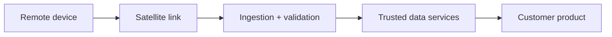

<div align="center">


# Jackson McCluskey

### I build products for data that starts somewhere hard to reach.

[](https://telemetrystation.com)
[](https://www.linkedin.com/in/jacksonmccluskey)

</div>

## Mission select

<div align="center">

[](https://telemetrystation.com)
[](#signal-path)
[](#system-access)
[](https://telemetrystation.com/articles)

</div>

```text
OPERATOR        Jackson McCluskey
ACTIVE MISSION  Telemetry Station
OBJECTIVE       Turn hard to manage remote data into useful, intuitive software
OPERATING MODE  Product ownership · hands-on engineering · production accountability
```

## Active mission · Telemetry Station

> [!IMPORTANT]
> **Satellite telemetry, without the black box.** [Telemetry Station](https://telemetrystation.com) gives connected-device teams a self-service path to estimate deployments, activate devices, manage usage, fund accounts, and retrieve data across Iridium SBD and Certus.

I co-founded the platform and lead its engineering from the network boundary to the customer experience: satellite ingestion, trusted data, TypeScript services, pricing, billing, web applications, observability, and support.

<div align="center">

[](https://telemetrystation.com)
[](https://telemetrystation.com/pricing)
[](https://telemetrystation.com/articles)

</div>

## Signal path



The difficult engineering lives between the nodes: intermittent connectivity, binary payloads, delivery retries, duplicate messages, conflicting state, cost controls, and the UX required to make all of it feel predictable.

## System access

<details>
<summary><strong>LEVEL 01 · PRODUCT SURFACE</strong> — make powerful systems feel simple</summary>

<br />

- React, Next.js, and React Native experiences built for customers—not network specialists.
- Typed workflows for device activation, funding, usage, pricing, mapping, and message retrieval.
- Product decisions informed by customer conversations and real production behavior.

</details>

<details>
<summary><strong>LEVEL 02 · DATA PLANE</strong> — turn raw traffic into trustworthy services</summary>

<br />

- TypeScript and Node.js services for ingestion, validation, normalization, storage, and delivery.
- MongoDB and Azure SQL systems with explicit handling for idempotency, retries, and conflicts.
- APIs designed so the same dependable data can power web, mobile, and customer integrations.

</details>

<details>
<summary><strong>LEVEL 03 · FIELD LINK</strong> — move data beyond terrestrial coverage</summary>

<br />

- Bidirectional integrations for Iridium SBD DirectIP and Certus IMT CloudConnect.
- Delivery through TCP, HTTPS, and email for devices operating in oceans and remote environments.
- Hands-on ownership where satellite networks, hardware, cloud infrastructure, and customer expectations meet.

</details>

<details>
<summary><strong>LEVEL 04 · RELIABILITY CORE</strong> — keep the mission observable</summary>

<br />

- AWS, Azure, Vercel, Linux, Docker, health checks, monitoring, alerts, retries, and fallbacks.
- Failure modes designed to be explicit, diagnosable, and recoverable instead of silently destructive.
- Ownership continues after release through production support, incident analysis, and iteration.

</details>

## Live engineering activity

> **Number of commits doesn't measure software engineering success.** I care more about customer outcomes, system reliability, sound decisions, and what a team can confidently build next. *Most of my work is versioned privately on Azure DevOps repositories! Sorry, GitHub!*

## Current objectives

- Grow Telemetry Station into the clearest way to launch and operate satellite-connected products.
- Build useful public tools and technical resources for remote-sensing and connected-device teams.
- Lead ambitious engineering work across connected products, data-intensive platforms, and consumer-facing applications.

---

<div align="center">

### Have a mission that begins beyond the edge of connectivity?

[](https://www.linkedin.com/in/jacksonmccluskey)

[Telemetry Station](https://telemetrystation.com) · [LinkedIn](https://www.linkedin.com/in/jacksonmccluskey) · [GitHub](https://github.com/jacksonmccluskey)

</div>
